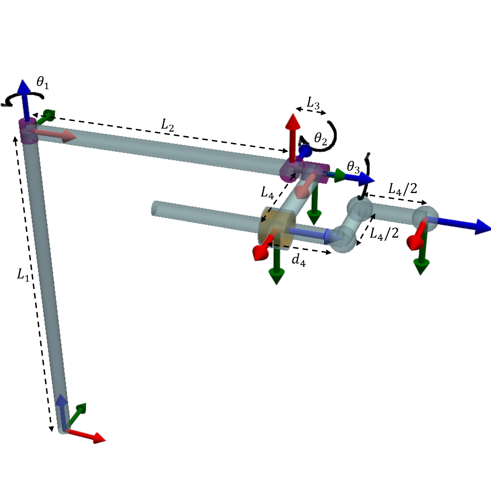
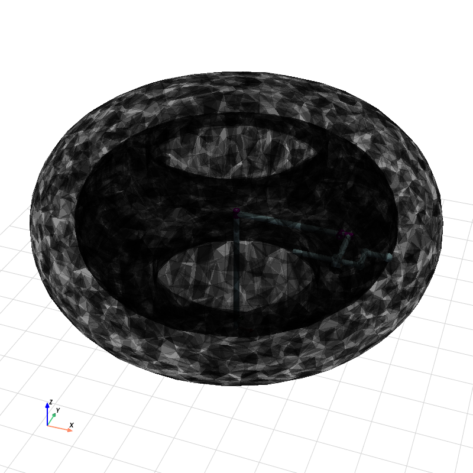
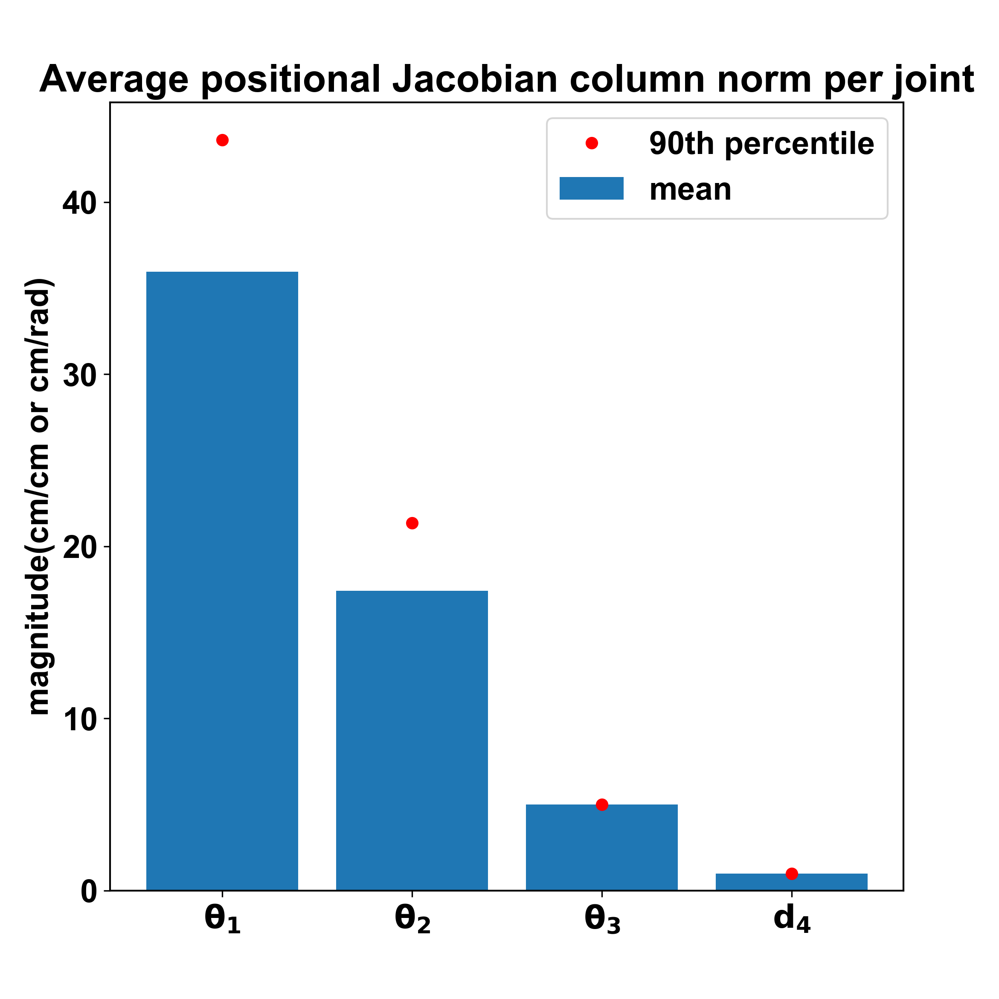
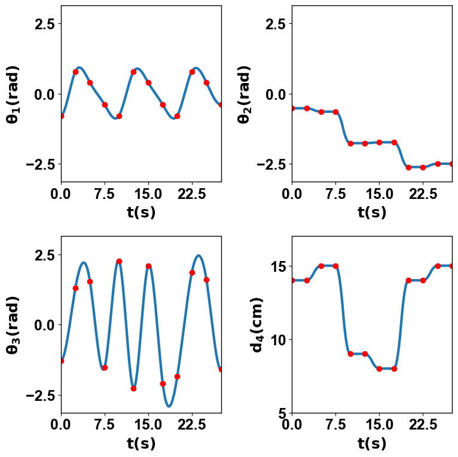
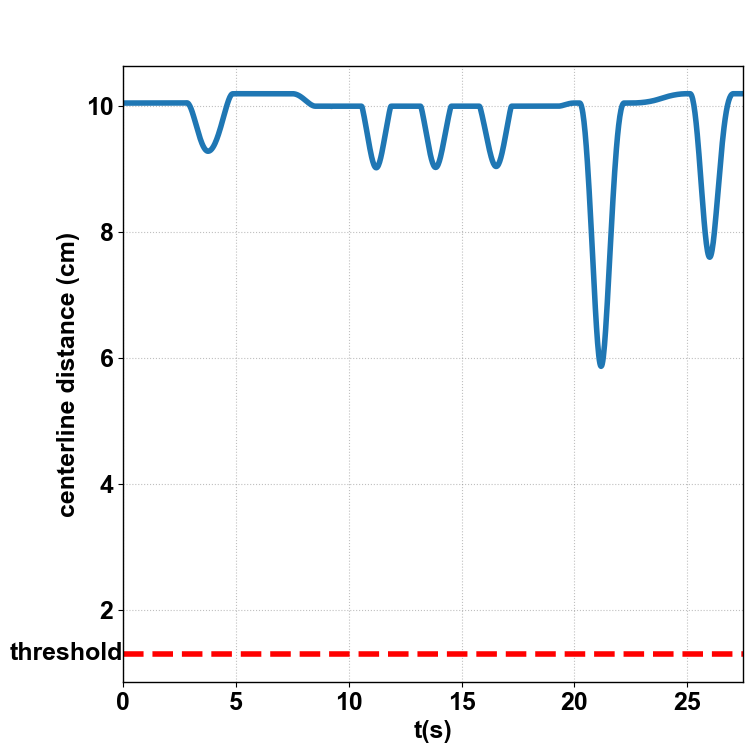

# Desktop Manipulator — ROS2

A 4-DoF RRPR desktop manipulator with trajectory planning, self-collision checking, and ROS2 integration using `ros2_control`.

<!-- Replace with your actual GIF once recorded -->


## Overview

I designed a 4-DoF desktop manipulator for simple desktop tasks such as holding and transporting objects. The project spans from kinematic derivation through to a full ROS2 control pipeline.

The project involves:
- Deriving the manipulator's forward/inverse kinematics and Jacobian
- Visualising the workspace using 3D alpha shape construction
- Jacobian-based sensitivity analysis on end-effector position and orientation
- Trajectory planning through 12 waypoints using cubic spline and parabolic blend interpolation
- Self-collision checking along the planned trajectory
- ROS2 integration with `ros2_control`, `JointTrajectoryController`, and RViz2 marker visualization

## System Architecture


## Configuration

The manipulator consists of 3 mutually orthogonal revolute joints and a prismatic joint with an L-shaped end effector.

<p float="left">
  
</p>

### DH Parameters

| i | Link length a<sub>i−1</sub> | Link twist α<sub>i−1</sub> | Link offset d<sub>i</sub> | Joint angle θ<sub>i</sub> |
|---|---|---|---|---|
| 1 | 0 | 0 | L₁ = 35 cm | θ₁ ∈ (−π, π] |
| 2 | L₂ = 25 cm | −π/2 | 0 | θ₂ ∈ (−π, 0] |
| 3 | 0 | −π/2 | L₃ = 2 cm | θ₃ ∈ (−π, π] |
| 4 | L₄ = 10 cm | 0 | d₄ ∈ [5, 15] cm | 0 |
| e | −L₄/2 | 0 | L₄/2 | 0 |

## Kinematics

### Forward Kinematics

The FK transforms coordinates and orientations between frames via joint variables. It is used in workspace generation, trajectory planning, and RViz2 marker visualization.

### Inverse Kinematics

The IK solves for joint variables given a desired end-effector pose. Since the manipulator provides only 4 controllable DoF, the IK does not always yield a solution for an arbitrary 6-DoF pose request. This is sufficient for grasping and transporting tasks; additional revolute joints at the end effector can be added if greater orientation flexibility is required.

### Jacobian

The Jacobian associates the velocity of the joint variables with the velocity of the end effector. It is used for sensitivity analysis and can be extended to velocity control and singularity analysis.

## Workspace

The workspace was generated by sampling 3.5 million joint configurations and constructing a 3D alpha shape in Python.

| Metric | Value |
|---|---|
| Estimated volume | 1.376 × 10⁵ cm³ |
| Max reach | 65.565 cm |
| Workspace efficiency (V / (4/3 π R³)) | 0.117 |

<p float="left">
  
  
</p>
<p>
  <em>Left: Workspace of the manipulator. Right: Jacobian-based positional sensitivity analysis.</em>
</p>

The sensitivity analysis quantifies how each joint affects the end-effector position and orientation. The mean and 90th percentile of the Jacobian column norms were plotted across the sampled configurations.

## Trajectory Planning

A trajectory was planned through 12 waypoints with a time interval of 2.5s between consecutive waypoints.

**Interpolation strategy:**
- **Parabolic blend** for θ₂ and d₄ — their via-point values are held constant between consecutive intervals, and cubic spline interpolation would introduce overshoot outside joint limits.
- **Cubic spline** for θ₁ and θ₃ — their trajectories exhibit a periodic trend, and cubic splines handle this smoothly.

At Δt = 2.5s, the resulting peak velocities and accelerations are:

| | Revolute | Prismatic |
|---|---|---|
| Max velocity | 2.52 rad/s | 3.88 cm/s |
| Max acceleration | 4.74 rad/s² | 3.84 cm/s² |

These values are consistent with the intended scale and operating regime of the desktop manipulator.

<p float="left">
  
  
</p>
<p>
  <em>Left: Joint variables along the planned trajectory. Right: Self-collision check.</em>
</p>

### Self-Collision Check

A self-collision check was performed along the trajectory, focusing on the second link from the base and the inner body of the telescopic prismatic joint. The distance between the finite centerlines of the two bodies remains consistently above the collision threshold (sum of the radii). Configurations that cause self-collision exist in the workspace but can be mitigated by using a retractable/expandable prismatic joint.

## ROS2 Integration

The project uses a standard `ros2_control` architecture:

**Packages:**
- `manipulator_description` — URDF/xacro robot model, `ros2_control` hardware config, launch files, RViz config
- `manipulator_planning` — Trajectory interpolation, action client for `JointTrajectoryController`, FK module, RViz marker visualization
- `manipulator_interfaces` — Custom service definition for waypoint-based trajectory planning

**Data flow:** The planner node runs the interpolation and sends a `FollowJointTrajectory` action goal to the `JointTrajectoryController`, which commands the mock hardware interface. The `JointStateBroadcaster` publishes joint states, `robot_state_publisher` computes TF transforms, and RViz2 displays the robot model along with trajectory path and waypoint markers.

## Prerequisites

- Ubuntu 24.04
- ROS2 Jazzy
- `ros2_control`, `ros2_controllers`
- Python: NumPy, SciPy

## Build

```bash
mkdir -p ~/manipulator_ws/src
cd ~/manipulator_ws/src
git clone https://github.com/IAM-ZeyangYuan/desktop-manipulator-ros2.git .
cd ~/manipulator_ws
rosdep install --from-paths src --ignore-src -r -y
pip install scipy
colcon build
source install/setup.bash
```

## Run

### Manual joint control (GUI sliders)

```bash
ros2 launch manipulator_description display.launch.py
```

### Automated trajectory playback

```bash
ros2 launch manipulator_description trajectory.launch.py
```

### ros2_control with action-based trajectory execution

Terminal 1 — launch the control pipeline:

```bash
ros2 launch manipulator_description ros2_control.launch.py
```

Terminal 2 — run the planner:

```bash
ros2 run manipulator_planning trajectory_action_client
```

## Analysis Scripts

The `analysis/` folder contains the original pure-Python scripts used for kinematic derivation, workspace generation, trajectory planning, and visualization (pre-ROS2):

| Script | Description |
|---|---|
| `trajectory_good.py` | Trajectory planning with cubic spline + parabolic blend |
| `self_collision.py` | Self-collision distance check along trajectory |
| `jacobian.py` | Jacobian derivation and sensitivity analysis |
| `workspace_w_arm.py` | Workspace generation with 3D alpha shapes |
| `arm_visual_arc_plus_v.py` | 3D manipulator visualization with PyVista |
| `interp_compare.py` | Comparison of interpolation methods |
| `trajectory_animation.py` | Animated trajectory visualization |

## Future Work

- Account for actuator-level constraints (e.g. torque limits) by incorporating a rigid-body dynamics model into the trajectory planning process
- Extend the self-collision check to include external environment geometry, enabling collision-aware trajectory planning for cluttered desktop scenes
- Physical robot build with a custom `ros2_control` hardware interface

## Technologies

ROS2 Jazzy · ros2_control · Python · NumPy · SciPy · PyVista · xacro