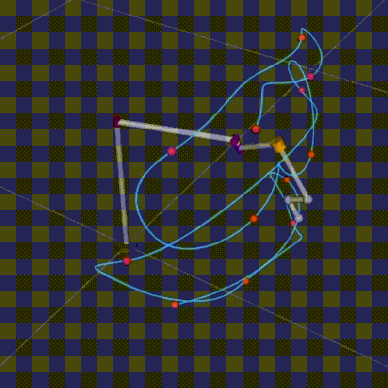

# Desktop Manipulator — ROS2

**Duration:**  11/2024 – 02/2025, 03/2026 - present  
**Tags:** `ROS2` · `ros2_control` ·`Python` · `Manipulator` · `Trajectory Planning`


## Overview

I designed a 4-DoF RRRP manipulator for simple desktop tasks such as holding and transporting objects. 


<p align="center">
  <br/>
  <sub>Trajectory animation in RViz2</sub>
</p>


The project involves:
- ROS2 architecture with `ros2_control`, `JointTrajectoryController`, and RViz2 marker visualization
- Trajectory planning through 12 waypoints using cubic spline and parabolic blend interpolation
- Self-collision checking along the planned trajectory
- Workspace visualization and its Jacobian-based sensitivity analysis
- The forward/inverse kinematics and Jacobian of the manipulator

 


## Configuration

The manipulator consists of 3 mutually orthogonal revolute joints and a prismatic joint with an L-shaped end effector.


<p align="center">
  <br/>
  <sub>Configuration of the manipulator</sub>
</p>


<details>
<summary>DH Parameters (click to expand)</summary>

| i | Link length a<sub>i−1</sub> | Link twist α<sub>i−1</sub> | Link offset d<sub>i</sub> | Joint angle θ<sub>i</sub> |
|---|---|---|---|---|
| 1 | 0 | 0 | L₁ = 35 cm | θ₁ ∈ (−π, π] |
| 2 | L₂ = 25 cm | −π/2 | 0 | θ₂ ∈ (−π, 0] |
| 3 | 0 | −π/2 | L₃ = 2 cm | θ₃ ∈ (−π, π] |
| 4 | L₄ = 10 cm | 0 | d₄ ∈ [5, 15] cm | 0 |
| e | −L₄/2 | 0 | L₄/2 | 0 |

</details>


## ROS2 Integration

The project uses a standard `ros2_control` architecture:

**Packages:**
- `manipulator_description` — URDF/xacro robot model, `ros2_control` hardware and controller config, launch files, RViz config
- `manipulator_planning` — Trajectory interpolation, action client for `JointTrajectoryController`, FK module
- `manipulator_interfaces` —  Custom interface for a waypoint-based trajectory planning service

**Data flow:** The trajectory planner node runs the interpolation and sends a `FollowJointTrajectory` action goal to the `JointTrajectoryController`, which commands the mock hardware interface. The `JointStateBroadcaster` publishes joint states, `robot_state_publisher` computes TF transforms, and RViz2 displays the robot model along with trajectory path and waypoint markers.

<!--## Prerequisites

- Ubuntu 24.04
- ROS2 Jazzy
- `ros2_control`, `ros2_controllers`
- Python: NumPy, SciPy
--->

## Build

```bash
mkdir -p ~/manipulator_ws/src
cd ~/manipulator_ws/src
git clone https://github.com/IAM-ZeyangYuan/desktop-manipulator-ros2.git .
cd ~/manipulator_ws
rosdep install --from-paths src --ignore-src -r -y
pip install scipy
colcon build
source install/setup.bash
```

## Run

### ros2_control with action-based trajectory execution

Terminal 1 — launch the control pipeline:

```bash
ros2 launch manipulator_description ros2_control.launch.py
```

Terminal 2 — run the trajectory planner:

```bash
ros2 run manipulator_planning trajectory_action_client
```

<!--
### Manual joint control (GUI sliders)

```bash
ros2 launch manipulator_description Display.launch.py
```


### Automated trajectory playback

```bash
ros2 launch manipulator_description trajectory.launch.py
```
--->

### Trajectory playback using service calls

Terminal 1 — launch the service-based pipeline:

```bash
ros2 launch manipulator_description service.launch.py
```

Terminal 2 — call the service with the with example way points 

```bash
ros2 service call /plan_trajectory manipulator_interfaces/srv/PlanTrajectory "{
  theta1: [-0.785, 0.785, 0.392, -0.392, -0.785, 0.785, 0.392, -0.392, -0.785, 0.785, 0.392, -0.392],
  theta2: [1.047197, 1.047197, 0.927295, 0.927295, -0.197396, -0.197396, -0.165149, -0.165149, -1.047198, -1.047198, -0.927296, -0.927296],
  theta3: [-2.863296, -0.278296, -0.033336, -3.108256, 0.695204, -3.836796, 0.523599, -3.665191, -3.419889, 0.278297, 0.033337, -3.174929],
  d4: [0.14, 0.14, 0.15, 0.15, 0.09, 0.09, 0.08, 0.08, 0.14, 0.14, 0.15, 0.15],
  delta_t: 2.5
}"
```


## Trajectory Planning

A trajectory was planned through 12 waypoints with a time interval of 2.5s between consecutive waypoints.

**Interpolation strategy:**
- **Parabolic blend** for θ₂ and d₄ — the waypoint values are held constant between consecutive intervals, and cubic spline interpolation would introduce overshoot outside joint limits.
- **Cubic spline** for θ₁ and θ₃ — the waypoints exhibit a periodic trend, which can be handled smoothly with cubic spline.

At Δt = 2.5s, the resulting peak velocities and accelerations are within the intended scale and operating regime of the desktop manipulator.

| | Revolute | Prismatic |
|---|---|---|
| Max velocity | 2.52 rad/s | 3.88 cm/s |
| Max acceleration | 4.74 rad/s² | 3.84 cm/s² |


<table align="center">
  <tr>
    <td align="center">
      <br/>
      <sub>Joint variables along the planned trajectory</sub>
    </td>
    <td align="center">
      <br/>
      <sub>Self-collision check</sub>
    </td>
  </tr>
</table>

### Self-Collision Check

A self-collision check was performed along the trajectory, focusing on the horizontal second link from the base and the inner body of the telescopic prismatic joint. The distance between the finite centerlines of the two bodies remains consistently above the collision threshold (sum of the radii). Configurations that cause self-collision exist in the workspace but can be mitigated by using a retractable prismatic joint.

## Workspace

The workspace was generated using 3D alpha shape construction with 3.5 million joint configuration samples in Python.

| Metric | Value |
|---|---|
| Estimated volume V| 1.376 × 10⁵ cm³ |
| Max reach R| 65.565 cm |
| Workspace efficiency (V / (4/3 π R³)) | 0.117 |


<table align="center">
  <tr>
    <td align="center">
      <br/>
      <sub>Workspace of the manipulator</sub>
    </td>
    <td align="center">
      <br/>
      <sub>Jacobian-based positional sensitivity analysis</sub>
    </td>
  </tr>
</table>

### Sensitivity Analysis
A Jacobian-based sensitivity analysis was used to quantify how each joint affects the end-effector position (and orientation). The mean and 90th percentile of the Jacobian column norms were plotted across the sampled configurations.

## Kinematics

**Forward Kinematics**: FK was used in workspace generation and trajectory planning.

<details>
<summary>Analytic expression (click to expand)</summary>

The transformation matrix from the end effector frame to the base frame is:

$$
{}_{e}^{0}T =
\left(
\begin{matrix}
c_1c_2c_3+s_1s_3 & -c_1c_2s_3+s_1c_3 & -c_1s_2 &
\frac{L_4}{2}(c_1c_2c_3+s_1s_3)-(d_4+L_3+\frac{L_4}{2})c_1s_2+L_2c_1 \\

s_1c_2c_3-c_1s_3 & -s_1c_2s_3-c_1c_3 & -s_1s_2 &
\frac{L_4}{2}(s_1c_2c_3-c_1s_3)-(d_4+L_3+\frac{L_4}{2})s_1s_2+L_2s_1 \\

-s_2c_3 & s_2s_3 & -c_2 &
-L_4s_2c_3-(d_4+L_3+\frac{L_4}{2})c_2+L_1 \\

0 & 0 & 0 & 1
\end{matrix}
\right)
$$

where:
$$
s_i \equiv \sin\theta_i,\quad
c_i \equiv \cos\theta_i,\quad
i = 1,2,3
$$

All the parameters are listed in the DH table.

</details>
<br>

**Inverse Kinematics**: The IK was used during trajectory planning in the Cartesian space, but it does not always yield a solution for an arbitrary 6-DoF pose request since the manipulator only provides 4 controllable DoFs. However, this is sufficient for simpe object holding and transporting tasks.
<!--
The IK solves for joint variables given a desired end-effector pose. Since the manipulator provides only 4 controllable DoF, the IK does not always yield a solution for an arbitrary 6-DoF pose request. This is sufficient for grasping and transporting tasks; additional revolute joints at the end effector can be added if greater orientation flexibility is required. 
--->
<details>
<summary>Analytic expression (click to expand)</summary>

For a requested position and orientation of the end effector:

$$
T_{request} =
\left(
\begin{matrix}
r_{11} & r_{12} & r_{13} & X \\
r_{21} & r_{22} & r_{23} & Y \\
r_{31} & r_{32} & r_{33} & Z \\
0 & 0 & 0 & 1
\end{matrix}
\right)
= {}_{e}^{0}T
$$

The joint variables are:

**Table: Inverse Kinematics**

|                | r₃₃ = ±1 | \|r₃₃\| ≠ 1 |
|----------------|----------|------------|
| θ₁ | `atan2( Y - (r21·L4)/(2√(r21²+r11²)), X - (r11·L4)/(2√(r21²+r11²)) )` | `atan2(r23, r13)` |
| θ₂ | `(∓1 - 1)/2 · π` | `-arccos(-r33)` |
| θ₃ | `∓ atan2( Y - (r21·L4)/(2√(r21²+r11²)), X - (r11·L4)/(2√(r21²+r11²)) ) ± atan2(∓r21, ∓r11)` | `atan2(-r32, r31)` |
| d₄ | `∓(L1 - Z) - L3 - L4/2` | solved from matching X, Y, Z entries |

</details>

<br>

**Jacobian**: The Jacobian was used for sensitivity analysis and can be extended to velocity control and singularity analysis.

<details>
<summary>Analytic expression (click to expand)</summary>

$$
{}^{0}\dot{x} =
\begin{pmatrix}
{}^{0}_{e}R & \mathbf{0}_{3\times 3} \\
\mathbf{0}_{3\times 3} & {}^{0}_{e}R
\end{pmatrix}
{}^{e}J \dot{q}
$$

where:

- ⁰ẋ: linear and angular velocity of the end effector relative to the base, expressed in the base frame  
- ⁰ₑR: rotation matrix between the base frame and the end effector frame  
- ᵉJ: Jacobian expressed in the end effector frame  
- q̇: velocity of the four joint variables 
---

$$
{}^{0}_{e}R =
\begin{pmatrix}
\sin\theta_1 \sin\theta_3 + \cos\theta_1 \cos\theta_2 \cos\theta_3 &
\sin\theta_1 \cos\theta_3 - \cos\theta_1 \cos\theta_2 \sin\theta_3 &
-\cos\theta_1 \sin\theta_2 \\

\sin\theta_1 \cos\theta_2 \cos\theta_3 - \cos\theta_1 \sin\theta_3 &
-\sin\theta_1 \cos\theta_2 \sin\theta_3 - \cos\theta_1 \cos\theta_3 &
-\sin\theta_1 \sin\theta_2 \\

-\sin\theta_2 \cos\theta_3 &
\sin\theta_2 \sin\theta_3 &
-\cos\theta_2
\end{pmatrix}
$$

---

$$
{}^{e}J =
\begin{pmatrix}
\big(-L_2 + (L_3+\tfrac{L_4}{2}+d_4)\sin\theta_2\big)\sin\theta_3 &
-(L_3+\tfrac{L_4}{2}+d_4)\cos\theta_3 &
0 & 0 \\

\big(-L_2 + (L_3+\tfrac{L_4}{2}+d_4)\sin\theta_2\big)\cos\theta_3 - \tfrac{L_4}{2}\cos\theta_2 &
(L_3+\tfrac{L_4}{2}+d_4)\sin\theta_3 &
\tfrac{L_4}{2} & 0 \\

-\tfrac{L_4}{2}\sin\theta_2\sin\theta_3 &
\tfrac{L_4}{2}\cos\theta_3 &
0 & 1 \\

-\sin\theta_2\cos\theta_3 &
-\sin\theta_3 &
0 & 0 \\

\sin\theta_2\sin\theta_3 &
-\cos\theta_3 &
0 & 0 \\

-\cos\theta_2 &
0 & 1 & 0
\end{pmatrix}
$$

</details>


## Analysis Scripts

The `python-analysis/` folder contains Python scripts used for trajectory planning, self collision check, workspace visualization, jacobian and sensitivity analysis.

| Script | Description |
|---|---|
| `trajectory_interpolation.py` | Trajectory planning with cubic spline + parabolic blend| 
| `self_collision.py` | Self-collision check along the trajectory |
| `jacobian.py` | Jacobian derivation |
| `sensitivity_analysis.py` | Jacobian-based sensitivity analysis on the end effector|
| `workspace.py` | Workspace generation with 3D alpha shapes (! need to be run on GPU (Windows / native Linux)) |
| `manipulator_visual.py` | 3D manipulator visualization with PyVista|


## Future Work

- Account for actuator-level constraints (e.g. torque limits) by incorporating a rigid-body dynamics model into the trajectory planning process
- Extend the self-collision check to include external environment geometry, enabling collision-aware trajectory planning for cluttered desktop scenes
- Physical robot prototype with a custom `ros2_control` hardware interface

